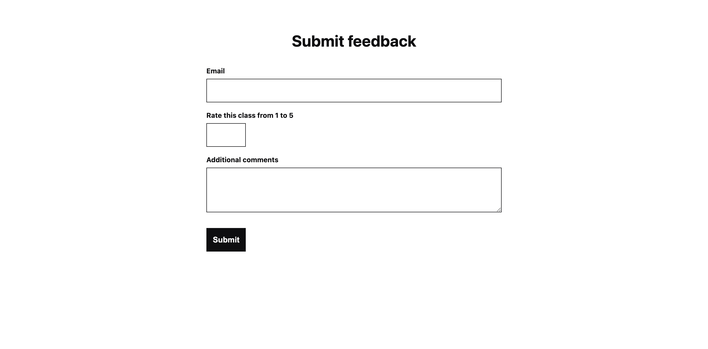

# GetSetUp coding demonstration task

This is an implementation of the [GetSetUp coding demonstration task](https://gist.github.com/patowens/927fe3eac2b8c21c813068f35aef691d). It uses [`express`](https://www.npmjs.com/package/express), [`ts-node`](https://www.npmjs.com/package/ts-node), and [`@aws-sdk/client-dynamodb`](https://www.npmjs.com/package/@aws-sdk/client-dynamodb).

## Task 1

The `POST /feedback/` API handler expects the following data:
- `userEmail` (required): the user email, i.e. user id. For a fully built website, I'd get this from authentication middleware. E.g. the middleware would define `req.user = AuthenticatedUser()`, and the API handler would use `req.user.email`. To keep this implementation simple, I don't implement authentication, and instead get the user email from the POST data.
- `classId` (required): the class id.
- `rating` (required): the number from 1-5.
- `comment` (optional): the short comment.

The frontend renders a form with `userEmail`, `rating`, and `comment` fields. The `classId` is retrieved from the `cid` query param. For a fully built website, the `userEmail` field would not be necessary, since the server would already know it via authentication.

### System requirements:

These are the versions I tested on:
- `node --version`: v18.14.2
- `npm --version`: 9.5.0
- `docker --version`: Docker version 20.10.22, build 3a2c30b
- `Browser`: Latest Chrome, Firefox, Safari, Edge, or Opera

### Install the code:

```
git clone git@github.com:kevinzang/gsu-coding-demo-task.git
cd gsu-coding-demo-task
npm install
docker pull amazon/dynamodb-local
```

### Run the code:

**Terminal 1:**

Start the Express Node.js server.

```
npm run server:start
```

**Terminal 2:**

Start the DynamoDB database.

```
npm run db:start
```

**Terminal 3:**

Create the DynamoDB tables.

```
npm run db:create-tables
```

**Browser:**

Go to http://localhost:3000/feedback?cid=2038432080.



## Task 2

### What changes would you want to do to make this more robust and resilient?

In terms of making this production-ready (not yet considering traffic levels), I'd separate dev and prod environments. The current implementation is only suitable for dev.

Prod has the following differences:
- Dev uses `ts-node` to run TypeScript directly. Prod compiles TypeScript into minified JavaScript and runs the JavaScript.
- Dev uses `nodemon` to reload the server when files change. Prod doesn't need this.
- Dev installs all dependencies. Prod doesn't need `devDependencies`.
- Dev runs on localhost, and uses local DynamoDB. Prod runs on machines specifically designed to serve web pages, and uses AWS DynamoDB.

I would also add automated tests for the frontend form and the backend API handler.

In terms of making this robust against high traffic levels:
- Run a load test with 10,000 requests per second.
- Analyze the load test results to pick more appropriate `ReadCapacityUnits` and `WriteCapacityUnits` values.
- Consider [on-demand capacity mode](https://docs.aws.amazon.com/amazondynamodb/latest/developerguide/HowItWorks.ReadWriteCapacityMode.html#HowItWorks.OnDemand).
- Consider rate-limiting the API handler so that there can't be too many requests at once.

### How could we analyze survey responses numerically?

Use [Amazon CloudWatch](https://aws.amazon.com/cloudwatch/) to monitor the API handler.

When the handler creates a `ClassUserFeedback` item, send metric data like this:
```
[
  {
    MetricName: "CREATE_FEEDBACK",
    Dimensions: [
      {Name: "RATING", Value: rating},
      {Name: "CLASS_ID", Value: classId},
    ],
    Unit: "None",
    Value: 1.0,
  }
]
```

Set up an alarm that fires when `1` rating counts exceed a certain threshold. See examples [here](https://docs.aws.amazon.com/sdk-for-javascript/v3/developer-guide/cloudwatch-examples-creating-alarms.html).

### How could we analyze survey responses textually?

Use [Amazon Comprehend](https://aws.amazon.com/comprehend/) to extract common phrases from the comments. One challenge is distinguishing real user comments from spam bot comments. We'd want to exclude the latter as much as possible before analyzing the data, but it's very difficult to accurately identify a bot just from a comment.

### What design changes could be done to make this easier to use for the teaching assistant?

Assuming the class id is the same as the Zoom meeting id, we give the TA both the Zoom url and the feedback url at the same time. That way the TA can just copy-paste the latter into the chat.

### We've asked you to use DynamoDB in your submission, how did you find it?

It was easy to get started. It works well for relatively simple data structures which can be described by a single table. It works poorly when data is needed from multiple tables, since there's no concept of a "join" like in SQL databases.

To maintain document uniformity:
- Define a TypeScript interface for every "item" type in DynamoDB.
- When reading from DynamoDB, unmarshall the read data into the TypeScript interface. If the data doesn't match the interface, raise an error.
- When writing to DynamoDB, only accept write data in the form of the TypeScript interface. If the data is provided by the user (e.g. API data), explicitly check that it matches the interface (e.g. `if (typeof data.comment === 'string')`). In theory the user can manually call the API with arbitrary data, so the types can be anything.
- Define reusable methods to read and write data as described above. Add a linter to force all reads and writes to go through these methods, so that engineers can't bypass the system by implementing their own methods.
